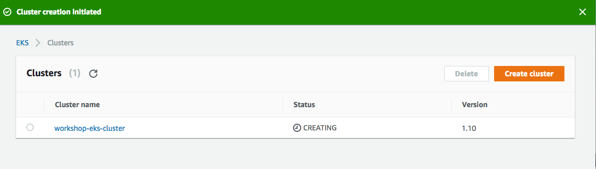

## Deploying a Kubernetes Cluster using EKS

## Elastic Container Service for Kubernetes (EKS)

[Elastic Kubernetes Service](https://aws.amazon.com/eks/getting-started) is AWS-managed Kubernetes cluster orchestration service. With EKS you will be able to launch highly-available Kubernetes clusters without spending time on undifferentiated heavy-lifting regarding managing the underlying infrastructure.

**Quick jump:**

* [1. Tutorial Overview](/06-DeployEKSCluster#1-tutorial-overview)
* [2. Installing Kubernetes tooling](/06-DeployEKSCluster#2-installing-kubernetes-tooling)

## 1. Tutorial Overview

During this hands-on labs we'll walkthrough creating an EKS Cluster and deploy our early created containers on it. It's important to had completed [01-SetupEnvironment](../01-SetupEnvironment/), [02-CreatingDockerImage](02-CreatingDockerImage/) and [03-CreateVPC](../03-CreateVPC/).

Having being able to successfully complete [04-DeployEcsCluster](04-DeployEcsCluster/) lab is recommended, while not a direct requirement.

## 2. Creating the Cluster

### Create EKS Service Role

At [IAM console](https://console.aws.amazon.com/iam/):

1. Choose Roles, then **Create role**.

2. Choose EKS from the list of services, then _Allows Amazon EKS to manage your clusters on your behalf for your use case_, then Next: Permissions.

You'll see two AWS-managed policies attached to it:

3. Choose Next: Review.

4. For Role name, enter a unique name for your role, such as `EKSServiceRole`, then choose Create role.

### Create a Sample VPC for EKS

At [CloudFormation Console](https://console.aws.amazon.com/cloudformation/) and select an AWS region that supports EKS -- which is currently available at `us-east-1`, `us-west-2` and `eu-west-1` regions.

1. Choose **Create Stack**.

2. Refer to `https://amazon-eks.s3-us-west-2.amazonaws.com/cloudformation/2018-08-30/amazon-eks-vpc-sample.yaml` CloudFormation template, while selecting **Specify an Amazon S3 template URL**, and click **Next**.

3. Choose a name for your Stack, like `EKSWorkshop` and hit **Next**.

4. Leave everything as the default values and click **Next**;

5. Click **Create**;

6. Wait for the **Status** to be *CREATE_COMPLETE*. This process may take 5 to 10 minutes to be completed;

### Getting Started with our first EKS cluster

Once logged into [AWS Management Console](https://console.aws.amazon.com/console/home), open [EKS Console](https://console.aws.amazon.com/eks/home), which is currently available at `us-east-1`, `us-west-2` and `eu-west-1` regions.

If it's your first time on EKS Console you'll see the following:

Choose a unique cluster name, like the following `workshop-eks-cluster`, then click on **Next Step**.

1. Select the EKS Service Role you had created above and the corresponding VPC, like the following:

2. Select subnets that spans **at least two different** Availability Zones (AZs).

3. Select the corresponding security group(s) that will be assigned to each EKS-managed [Elastic Network Interface](https://docs.aws.amazon.com/vpc/latest/userguide/VPC_ElasticNetworkInterfaces.html). Please refer to [Security Groups considerations](https://docs.aws.amazon.com/eks/latest/userguide/sec-group-reqs.html) under EKS Documentation.

4. Choose **Create**

5. Wait a few minutes while your EKS Cluster is being created.

## 2. Installing Kubernetes Tooling

### kubectl

Accessing and configuring an EKS cluster is the same of accessing and configuring any other standard Kubernetes cluster which means we'll need `kubectl` installed.

To get started, please refer to official `kubectl` installation guide at Kubernetes project website:

`https://kubernetes.io/docs/tasks/tools/install-kubectl/`

### aws-iam-authenticator

[Heptio](https://heptio.com/), a Kubernetes Technology Partner, developed a plugin to simplify Kubernetes cluster authentication using AWS IAM.

Installing `aws-iam-authenticator` is straightforward. Download the binary for your operating system:

- [macOS](https://amazon-eks.s3-us-west-2.amazonaws.com/1.10.3/2018-07-26/bin/darwin/amd64/aws-iam-authenticator)
- [Windows](https://amazon-eks.s3-us-west-2.amazonaws.com/1.10.3/2018-07-26/bin/windows/amd64/aws-iam-authenticator.exe)
- [Linux](https://amazon-eks.s3-us-west-2.amazonaws.com/1.10.3/2018-07-26/bin/linux/amd64/aws-iam-authenticator)

Then, add the binary to your `bin` path, like `usr/local/bin`.

### _Optional_ 

Despite being a new service, EKS already counts with a tooling ecosystem that makes easier some repetitive administration tasks.

One of those tools is `eksctl`, which extends standard `kubectl` and `aws` CLI and provides a consistent CLI experience for a wide-range of EKS management tasks.

You can install `eksctl` by following the instructions below:

`https://eksctl.io`

## 3. Accessing your EKS Cluster with `kubectl`

> Please, make sure you have [latest AWS CLI installed](https://docs.aws.amazon.com/cli/latest/userguide/installing.html)

### Updating kubeconfig

With `kubectl`, `aws-iam-authenticator` and `aws` CLI installed do the following on your Terminal:

    $ aws eks update-kubeconfig --name <cluster_name>

To test, just query your cluster using standard `kubectl` command:

    $ kubectl get svc

You'll see something like the following:

    NAME         TYPE        CLUSTER-IP   EXTERNAL-IP   PORT(S)   AGE 
    kubernetes   ClusterIP   10.100.0.1   <none>        443/TCP   19m

## 4. Launching EKS Worker Nodes

EKS is an AWS-managed Kubernetes control plane which means you can just bring your EC2-based (soon Fargate) worker nodes.

AWS provides an [EKS-Optimized AMI](https://docs.aws.amazon.com/eks/latest/userguide/eks-optimized-ami.html) out of the box that will be used during this lab. You can customize it based on your specific needs by forking the [amazon-eks-ami at GitHub](https://github.com/awslabs/amazon-eks-ami).